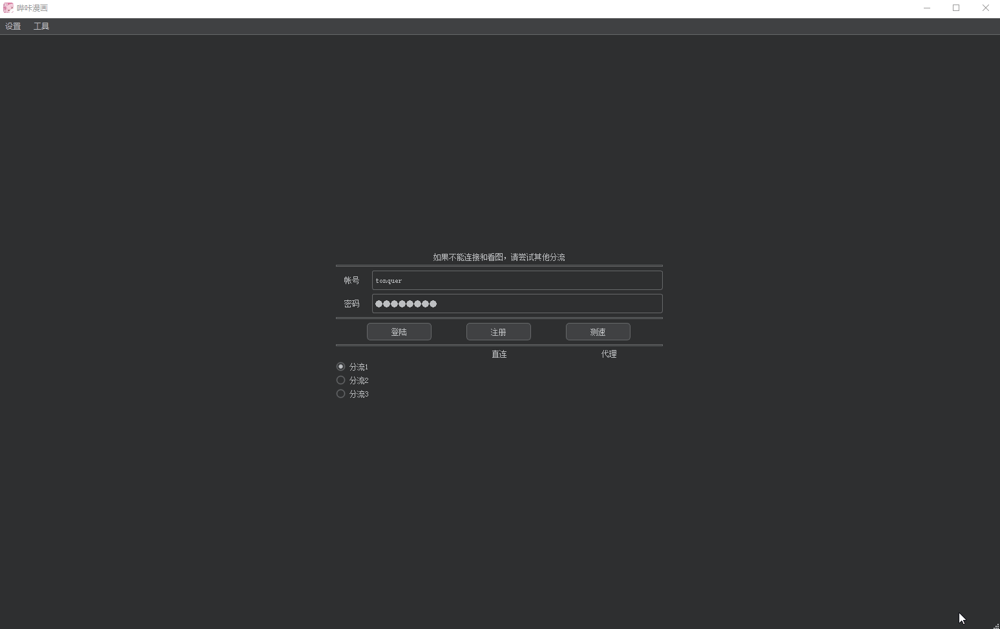
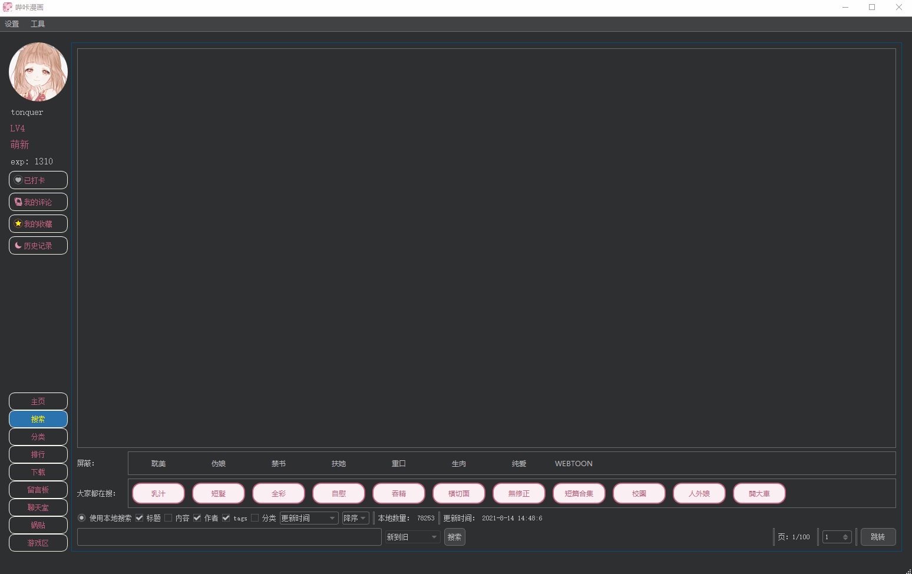
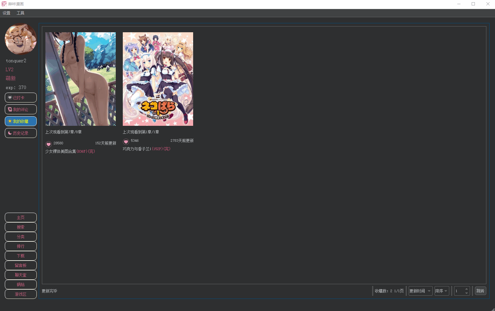

# PicACG

## [简体中文](README.md) | English

- PicACG PC Client (Support Windows, Linux and macOS), using QT as interface.
- This project is only for technical references, please do not use it for other purposes.
- If you think this project is helpful, please give it a Star, thanks!
- If you encounter any problems, please post them to Issue.

## Features
- Most features of PicACG PC Client have been implemented.
- Support for viewing and downloading.

## My other projects
   
 

## How to use
  ### Windows (tested on Win10)
  1. Download the latest version at https://github.com/tonquer/picacg-qt/releases
  2. Unzip
  3. Run start.exe
  4. Updates can be installed by downloading the latest version and overwrite the original directory.
  5. If waifu2x cannot be initialized, please update the graphics driver and install [VS Library](https://download.visualstudio.microsoft.com/download/pr/366c0fb9-fe05-4b58-949a-5bc36e50e370/015EDD4E5D36E053B23A01ADB77A2B12444D3FB6ECCEFE23E3A8CD6388616A16/VC_redist.x64.exe). If waifu2x still cannot be enabled, your computer does not support Vulkan and cannot use waifu2x.

  ### macOS (tested on macOS 10.15.7)
  1. Download the latest version at https://github.com/tonquer/picacg-qt/releases
  2. Unzip
  3. Drag PicACG into the Applications folder on the left sidebar of the Finder.
  4. Find and run PicACG from the Launchpad.
  #### for M1 Mac users
  * I don't have an ARM Mac device, so I am not able to provide you the packed application for ARM Mac.
  * If you have an ARM Mac device (e.g. M1 Mac), you can manually run or pack the application following the steps below.

  ### Linux (tested on deepin 20.2)
  1. Download qt dependencies at http://ftp.br.debian.org/debian/pool/main/x/xcb-util/libxcb-util1_0.4.0-1+b1_amd64.deb
  2. Install the dependencies (sudo dpkg -i ./libxcb-util1_0.4.0-1+b1_amd64.deb)
  3. Download the latest version at https://github.com/tonquer/picacg-qt/releases
  4. tar -zxvf bika.tar.gz
  5. cd bika && chmod +x start
  6. ./start
  7. If you want to use waifu2x, please make sure your device supports vulkan, and then install the vulkan driver package (sudo apt install mesa-vulkan-drivers)

## waifu2x settings
  Pleasse see https://github.com/tonquer/picacg-qt/discussions/76

## Proxy issues
  Please see https://github.com/tonquer/picacg-qt/discussions/48

## How to build
  ### Use Git Actions
  1. Check the result in [Git Actions](https://github.com/tonquer/picacg-qt/actions)

## Interface

* Login

* Search

* Comic details

* Download

* Browsing pictures

* waifu2x

## Thanks for the following projects
  ### waifu2x support
     
     
     
  ### Qt support
     
     
  ### Qt skin
     
  ### Qt smooth scrolling
     
